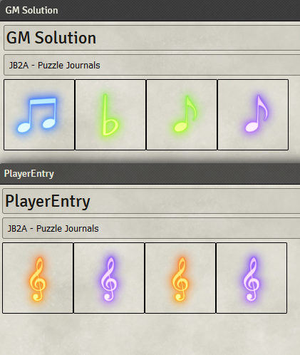
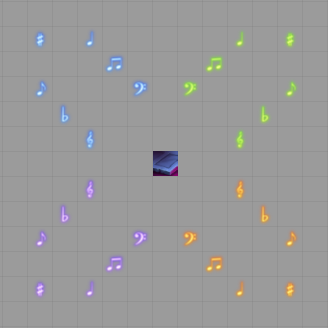
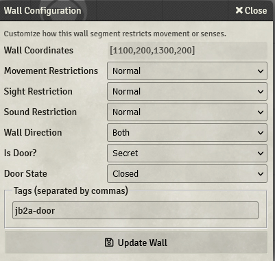

# JB2A Puzzle

## Overview

This module provides a compendium with several macros for use in creating a musical note password puzzle. In order to advance the players must match the code exactly to unlock some form of secret door.
**This version of the module will only work for the V10 version of FoundryVTT.**
For V9, see this page: [music_puzzle info on website](https://jb2a.com/home/content-information/#music_puzzle)

## Install
- Copy this manifest link : 
https://github.com/Jules-Bens-Aa/jb2a_puzzle/releases/latest/download/module.json
- Go to your FoundryVTT's "Add-on Modules" tab
- Click on "Install Module"
- Wait for the list of modules to appear
- Paste the manifest link in the relevant field and click install.
- Don't close this tab just yet ! You might need to install a couple of other modules listed in the next step.

## Setup

To setup the puzzle you simply need to enable the following modules and use our setup macro.

-   Monk's Active Tiles
-   Sequencer
-   Tagger
-   The JB2A Patreon module (technically only needs to be installed)

You can find our setup macro in the compendium JB2A - Puzzle - Macros. Be sure to import all three macros into the world!
When you execute the setup you should see a whole slew of tiles appear in the center of your scene in a pre-defined, arbitrary pattern like this:

The musical notes are already setup with Monk's Active Tiles triggers and will play the associated animated effect when an actor steps on it. The pressure plate will automatically execute the pressure plate macro that you imported from the compendium.

Note: If the content of the "GM Solution" and the "PlayerEntry" journals are identical (which is the case when you forst execute the "Puzzle Setup" macro), the doors will open when the players will step on the "Pressure Plate" tile, which is likely not what you want to happen straight away. 
Executing the "Pressure Plate" macro or stepping on the tile preemptively with a token, before the session, will fill the "GM solution" journal with a pattern which will ensure the doors won't open the first time the players will step on the tile.

### Setting Up Doors

The pressure plate is best accompanied with some secret doors that you want to be opened when the password is entered correctly. In order to set this up, you simply need to create a door (works with any type, doesn't have to be secret), then double right-click on the door to access its settings. In the settings at the bottom is a place for you to put tags. Simply add the `jb2a-door` tag and the pressure plate will automagically open and close the door when the password is entered correctly.

## Cleanup

Are you done with the session where the puzzle was located, or don't want all of the macros in your macro directory anymore? Well, cleanup is as simple as using the JB2A - Puzzle Cleanup macro! This macro will delete all of the imported and auto-generated macros, tiles, journals, and folders from your world.

## Credits
Thanks to @Ethck for the massive help at refactoring the module !

## Update
Thanks to @Appak and for letting us know we forgot to add a check for Forge in the 'Pressure Plate' macro. 
Now **actually** works in the Forge when the JB2A Patreon module is installed through the bazaar ! Again, thanks @Ethck for this amazing reworks !
Also thanks to @Wasp for the oneliner, much better ;)